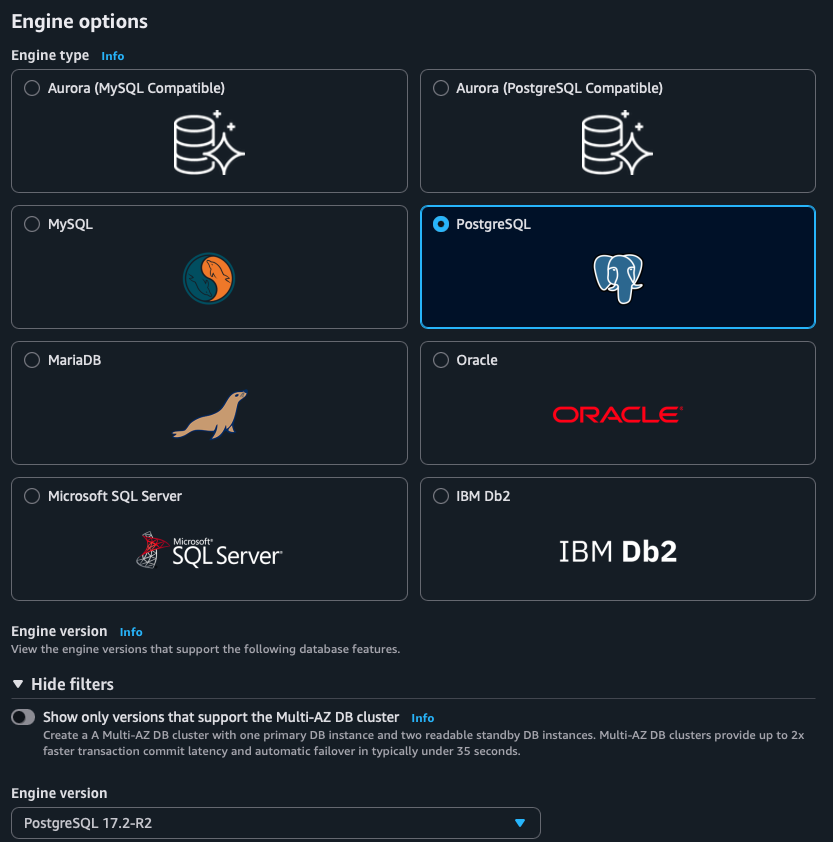
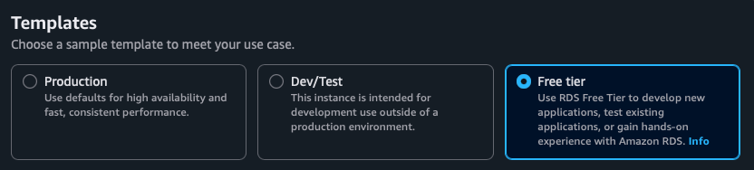
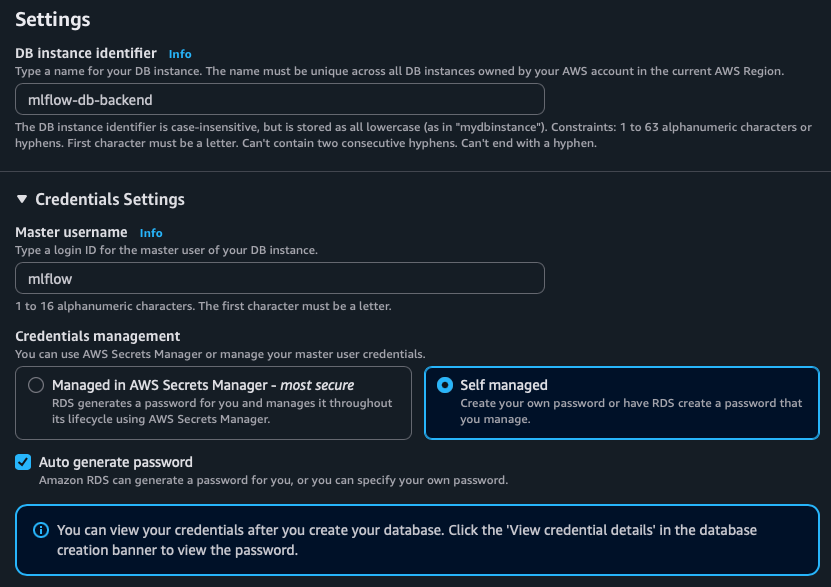
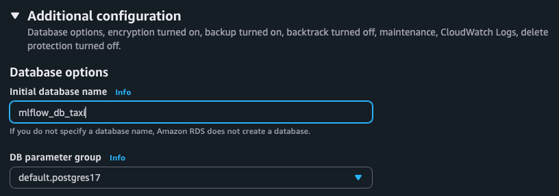
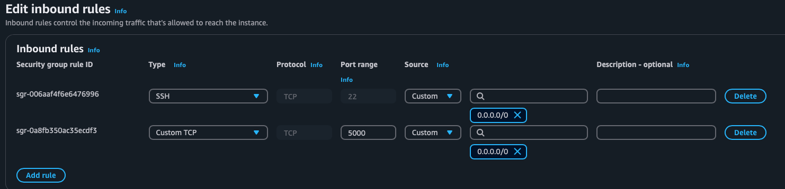
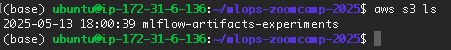
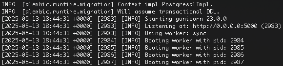

# Setup MLFlow on AWS

Source https://github.com/DataTalksClub/mlops-zoomcamp/blob/main/02-experiment-tracking/mlflow_on_aws.md

## Security Group

Update security group so it accepts connections to and from:

* SSH (port 22)
* HTTP (port 5000)

## S3 Bucket

Create an S3 bucket and name it ```mlflow-artifacts-experiments```.

Note: Name must be unique across all AWS regions within a partition.

## Postgres DB with RDS

Create new PostgreSQL database as backend database.


Select PostgreSQL engine and select Free Tier template.


Set name for db instance ```mlflow-db-backend```
Set master username ```mlflow```
Select option to Auto generate a password.


Under Additional Configuration, specify an initial database name ```mflow_db_taxi```


Keep track of the following information

* master username
* password
* initial database name
* endpoint

After the DB instance is created, go to the RDS console, select the new db. Under Connectivity and security, select the VPC security group. Modify the security group by adding a new inbound rule that allows PostgreSQL connections on the port 5432 from the security group of the EC2 instance. This will connect the server to the PostgreSQL db.

## Connect to the EC2 Instance

Update the EC2 instance security group to allow the following

Type: Custom TCP
Port Range: 5000
Source: 0.0.0.0/0



```ssh mlops-zoomcamp```

Install packages to environment

```pip3 install -r requirements.txt```

Check for access to S3 bucket

```aws s3 ls```



Run mlflow command

```mlflow server -h 0.0.0.0 -p 5000 --backend-store-uri postgresql://<DB_USER>:<DB_PASSWORD>@<DB_ENDPOINT>:5432/<DB_NAME> --default-artifact-root s3://<S3_BUCKET_NAME>```



Access the remote experiment tracking server locally by going to address ```http://<EC2_PUBLIC_DNS>:5000```
