# Experiment Tracking

## What is experiment tracking?

Model Architecture + Model Training + Model Evaluation

It's a process of tracking all releavnt information in ML experiments.

* Code
* Version
* Environment
* Data
* Model
* Artifacts
* Metrics
* Hyperparameters, etc

## Why does experiment tracking matter?

Reproducibility

* repeat the model performance

Organization

* track information in a detailed, organized manner
* allows for better working collaboration

Optimization

* train a model with the best performance

## Tool: MLflow

Open source platform for the ML lifecycle

ML lifecycle = building and maintaining ML models

### Python Package

```pip install mlflow```

Contains 4 modules:

* Tracking
  * focused on experiment tracking
* Models
  * packaging ML models
* Model Registry
  * used for model management
* Projects
  * packages code in reproducible and reusable way

### Tracking

* organize your experiments into runs
* run = trial for each experiment
* Tracks: parameters, metrics, metadata, artifacts, models

Also logs extra information about the run

* source code
* version of the code (git commit)
* start and end time
* author

### Locally run MLflow

```mlflow ui```

Open up url http://127.0.0.1:<port_number>

Store artifacts in sqlite

```mlflow ui --backend-store-uri sqlite:///mlflow.db```

Shows UI for MLflow

Create experiment and name it

Can store results in artifact location

Make requirements.txt

```
mlflow
jupyter
scikit-learn
pandas
seaborn
hyperopt
xgboost
boto3
psycopg2-binary
```

```pip install -r requirements.txt```

### Run MLflow Remotely in EC2

In Jupyter Notebook

```
import mlflow

mlflow.set_tracking_uri('http://<EC2_PUBLIC_DNS>:5000')
```

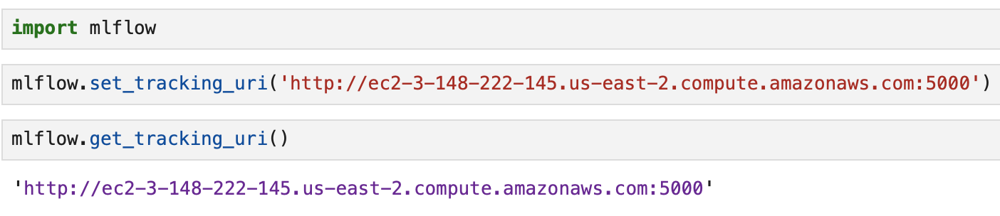

Test run mlflow

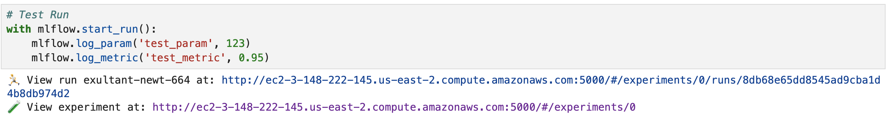

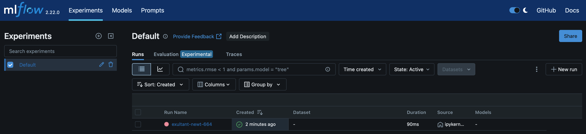

Set up the MLflow experiment and name it ```nyc-taxi-experiment```

```mflow.set_experiment('nyc-taxi-experiment')```

After training linear regression model, try an MLFlow run training with Lasso model and alpha = 0.01
```
with mlflow.start_run():
    mlflow.set_tag('developer', '<name>')

    mlflow.log_param('train-data-path', './data/green_tripdata_2021-01.csv')
    mlflow.log_param('valid-data-path', './data/green_tripdata_2021-02.csv')

    alpha = 0.01
    mlflow.log_param('alpha', alpha)

    lr = Lasso(alpha)
    lr.fit(X_train, y_train)

    y_pred = lr.predict(X_val)
    rmse = root_mean_squared_error(y_val, y_pred)
    mlflow.log_metric('rmse', rmse)
```

Try running a new experiment with alpha = 0.1

### Hyperparameter Tuning

```import xgboost as xgb```

```
from hyperopt import fmin, tpe, hp, STATUS_OK, Trials
from hyperopt.pyll import scope
```

```hyperopt``` is a library that uses bayesian methods to find best parameters
```fmin``` minimizes the object function
```tpe``` algorithm used to control logic
```hp``` defines search space for each hyperparameter
```STATUS_OK``` is a signal letting hyperopt know the run is successful
```Trials``` tracks information for each run

Create matrices for xgboost.

```
train = xgb.DMatrix(X_train, label=y_train)
valid = xgb.DMatrix(X_val, label=y_val)
```

Define the objective function.

```
def objective(params):
    with mlflow.start_run():
        mlflow.set_tag("model", "xgboost2")
        mlflow.log_params(params)
        booster = xgb.train(
            params=params,
            dtrain=train,
            num_boost_round=1000,
            evals=[(valid, 'validation')],
            early_stopping_rounds=50
        )
        y_pred = booster.predict(valid)
        rmse = root_mean_squared_error(y_val, y_pred)
        mlflow.log_metric("rmse", rmse)
    
    return {'loss': rmse, 'status': STATUS_OK}
```

Define search space, the range, for each hyperparameter

```
search_space = {
    'max_depth': scope.int(hp.quniform('max_depth', 4, 100, 1)),
    'learning_rate': hp.loguniform('learning_rate', -3, 0),
    'reg_alpha': hp.loguniform('reg_alpha', -5, -1),
    'reg_lambda': hp.loguniform('reg_lambda', -6, -1),
    'min_child_weight': hp.loguniform('min_child_weight', -1, 3),
    'objective': 'reg:squarederror', #reg:linear was original, squarederrr is preferred
    'seed': 42
}
```

```hp.quniform``` = uniform distribution low to high
```hp.loguniform``` = logarithm of values is uniformly distrbuted

fmin will optimize the objective method by minimizing the output

```
best_result = fmin(
    fn=objective,
    space=search_space,
    algo=tpe.suggest,
    max_evals=50,
    trials=Trials()
)
```

Autolog allows for automatic logging of

* parameters
* metrics
* models
* artifacts
* training metadata

without explicit log statements.

Disable autolog

```mlflow.xgboost.autolog(disable=True)```

Train the model with the best parameters and save run to MLflow

```
with mlflow.start_run():
    
    train = xgb.DMatrix(X_train, label=y_train)
    valid = xgb.DMatrix(X_val, label=y_val)

    best_params = {
        'learning_rate': 0.09585355369315604,
        'max_depth': 30,
        'min_child_weight': 1.060597050922164,
        'objective': 'reg:linear',
        'reg_alpha': 0.018060244040060163,
        'reg_lambda': 0.011658731377413597,
        'seed': 42
    }

    mlflow.log_params(best_params)

    booster = xgb.train(
        params=best_params,
        dtrain=train,
        num_boost_round=1000,
        evals=[(valid, 'validation')],
        early_stopping_rounds=50
    )

    y_pred = booster.predict(valid)
    rmse = mean_squared_error(y_val, y_pred, squared=False)
    mlflow.log_metric("rmse", rmse)

    with open("models/preprocessor.b", "wb") as f_out:
        pickle.dump(dv, f_out)
    mlflow.log_artifact("models/preprocessor.b", artifact_path="preprocessor")

    mlflow.xgboost.log_model(booster, artifact_path="models_mlflow")
```

Run experiment with multiple models

```
from sklearn.ensemble import RandomForestRegressor, GradientBoostingRegressor, ExtraTreesRegressor
from sklearn.svm import LinearSVR

mlflow.sklearn.autolog()

for model_class in (RandomForestRegressor, GradientBoostingRegressor, ExtraTreesRegressor, LinearSVR):

    with mlflow.start_run():

        mlflow.log_param("train-data-path", "./data/green_tripdata_2021-01.csv")
        mlflow.log_param("valid-data-path", "./data/green_tripdata_2021-02.csv")
        mlflow.log_artifact("models/preprocessor.b", artifact_path="preprocessor")

        mlmodel = model_class()
        mlmodel.fit(X_train, y_train)

        y_pred = mlmodel.predict(X_val)
        rmse = mean_squared_error(y_val, y_pred, squared=False)
        mlflow.log_metric("rmse", rmse)
```

## Model Management

Source: https://neptune.ai/blog/ml-experiment-tracking

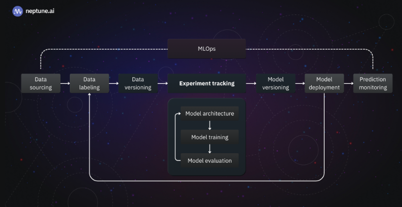

Model Management is:
Experiment Tracking + Model Versioning + Model Deployment + Scaling Hardware

Using excel/spreadsheet/folder system

* basic way of managing
* error prone (may override previous model)
* no versioning
* no model lineage: unclear hyperparameters, training/validation sets

Saving models with mlflow.log_artifact or mlflow.\<model\>.log_model

```
with mlflow.start_run():

    mlflow.set_tag("developer", "cristian")

    mlflow.log_param("train-data-path", "./data/green_tripdata_2021-01.csv")
    mlflow.log_param("valid-data-path", "./data/green_tripdata_2021-02.csv")

    alpha = 0.1
    mlflow.log_param("alpha", alpha)

    lr = Lasso(alpha)
    lr.fit(X_train, y_train)

    y_pred = lr.predict(X_val)
    rmse = mean_squared_error(y_val, y_pred, squared=False)
    mlflow.log_metric("rmse", rmse)

    #Tracking our model
    mlflow.log_artifact(local_path="models/lin_reg.bin", artifact_path="models_pickle")
```

```
#For the purpose of this example, let's turn off autologging
mlflow.xgboost.autolog(disable=True)

with mlflow.start_run():
    
    train = xgb.DMatrix(X_train, label=y_train)
    valid = xgb.DMatrix(X_val, label=y_val)

    best_params = {
        'learning_rate': 0.09585355369315604,
        'max_depth': 30,
        'min_child_weight': 1.060597050922164,
        'objective': 'reg:linear',
        'reg_alpha': 0.018060244040060163,
        'reg_lambda': 0.011658731377413597,
        'seed': 42
    }

    mlflow.log_params(best_params)

    booster = xgb.train(
        params=best_params,
        dtrain=train,
        num_boost_round=1000,
        evals=[(valid, 'validation')],
        early_stopping_rounds=50
    )

    y_pred = booster.predict(valid)
    rmse = mean_squared_error(y_val, y_pred, squared=False)
    mlflow.log_metric("rmse", rmse)

    #Model tracking
    mlflow.xgboost.log_model(booster, artifact_path="models_mlflow")
```

Log the DictVectorizers

```
with open("models/preprocessor.b", "wb") as f_out:
    pickle.dump(dv, f_out)
mlflow.log_artifact("models/preprocessor.b", artifact_path="preprocessor")
```

### Compare Models

Select all runs and compare

Parallel Coordinates Plot

* learning rate
* max_depth
* min_child_weight
* rmse

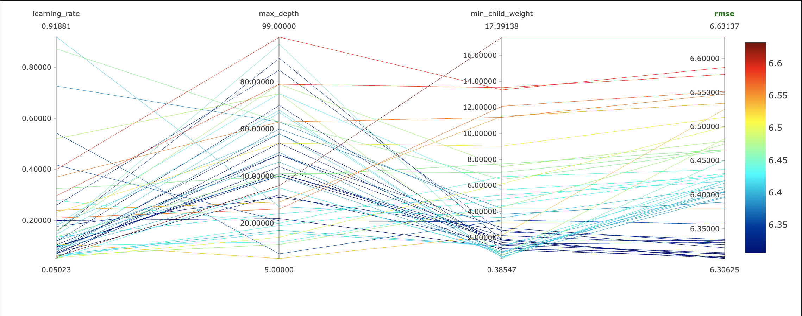

Scatter Plot

* X-axis: learning_rate
* Y-axis: rmse

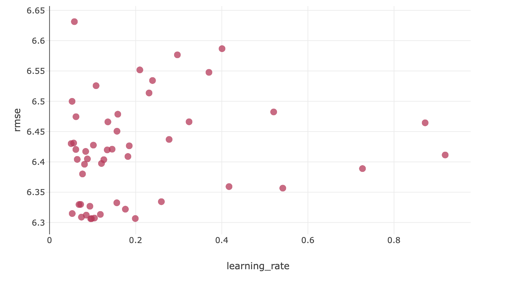

* X-axis: max_depth
* Y-axis: rmse

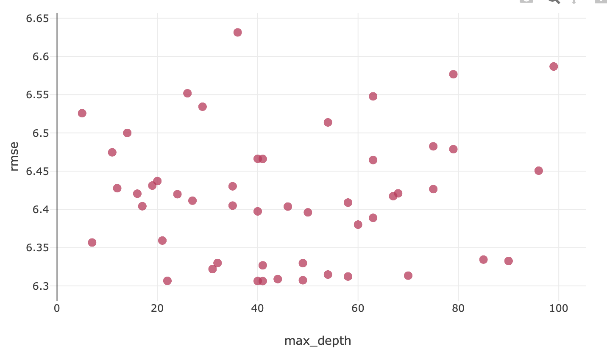

* X-axis: min_child_weight
* Y-axis: rmse

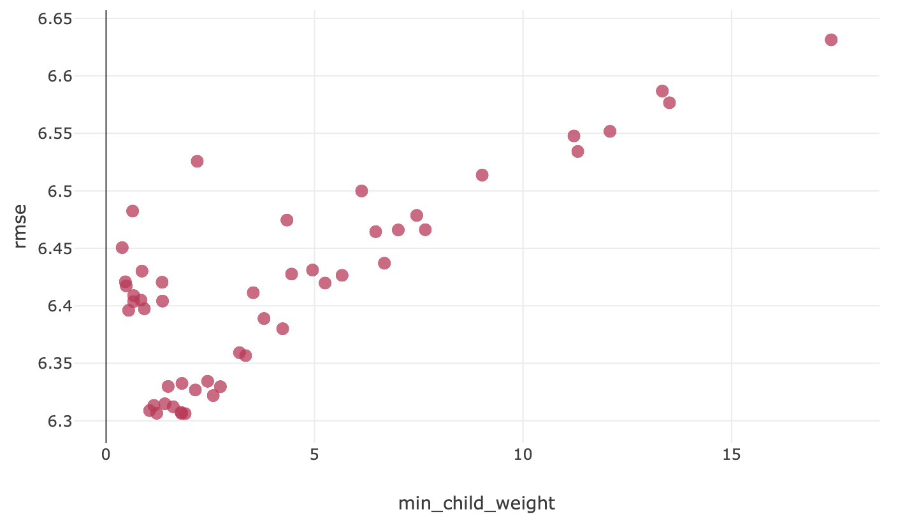

Contour Plot

* X-axis: learning_rate
* Y-axis: max_depth
* Z-axis: rmse

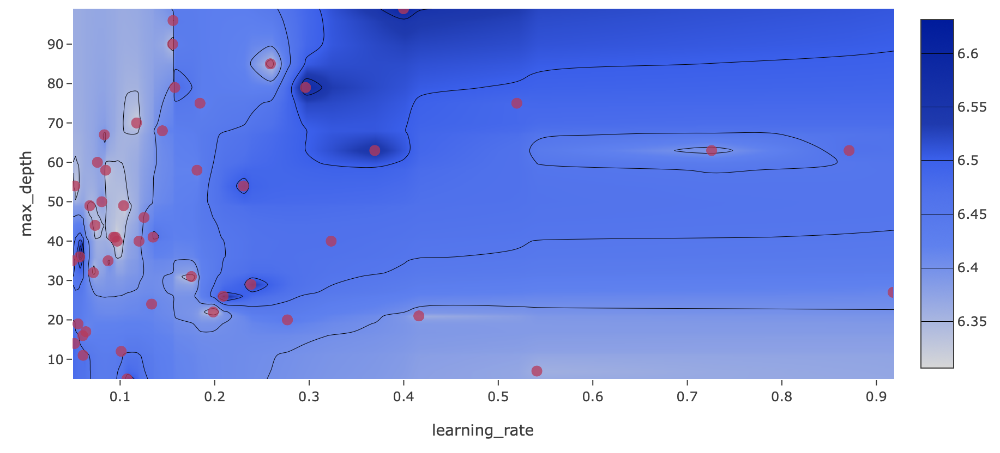

* X-axis: learning_rate
* Y-axis: min_child_weight
* Z-axis: rmse

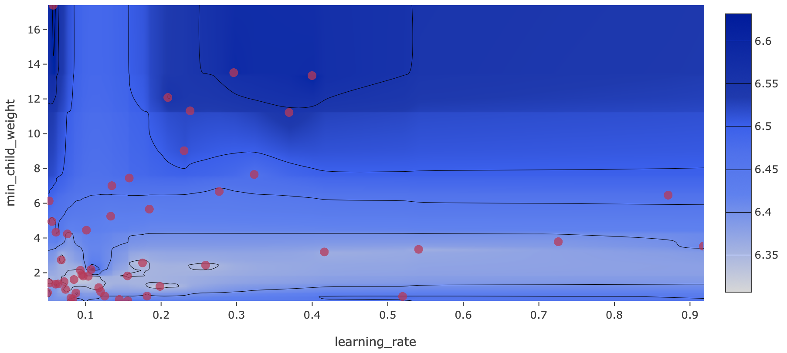

Select lowest possible RMSE score. Check duration is shorter and max_depth is lower also. Choose the model with the least complexity.

Duration: 1.1min

```
mlflow.xgboost.autolog(disable=True)
```

```
with mlflow.start_run():
    train = xgb.DMatrix(X_train, label=y_train)
    valid = xgb.DMatrix(X_val, label=y_val)

    best_params = {
        'learning_rate': 0.19913755185234963,
        'max_depth': 22,
        'min_child_weight': 1.2142790557597472,
        'objective': 'reg:squarederror',
        'reg_alpha': 0.33313132563273024,
        'reg_lambda': 0.008551282616462179,
        'seed': 42,
    }

    mlflow.set_tag('parameters', 'best')
    mlflow.log_params(best_params)

    booster = xgb.train(
        params=best_params,
        dtrain=train,
        num_boost_round=1000,
        evals=[(valid, 'validation')],
        early_stopping_rounds=50
    )

    y_pred = booster.predict(valid)
    rmse = root_mean_squared_error(y_val, y_pred)
    mlflow.log_metric('rmse', rmse)

    with open('models/preprocessor.b', 'wb') as f_out:
        pickle.dump(dv, f_out)
    mlflow.log_artifact('models/preprocessor.b', artifact_path='preprocessor')

    mlflow.xgboost.log_model(booster, artifact_path='models_mlflow')
```

Download notebook

```scp -i ~/.ssh/<key_name>.pem ubuntu@<Public_DNS>:/home/ubuntu/notebooks/experiment-duration-green.ipynb ./experiment-duration-green.ipynb```

To select a model, we look at the time in training, the RMSE, and the model size in MB.

## Model Registry

What is the model registry?

A centralized model store, set of APIs, and a UI, to collaboratively manage the full lifecycle of an MLFlow model.

It only lists the models that are production ready. Need some CI/CD to deploy the model.

What information does it provide?

* Model lineage
* Model versioning
* Stage transitions
* Annotations

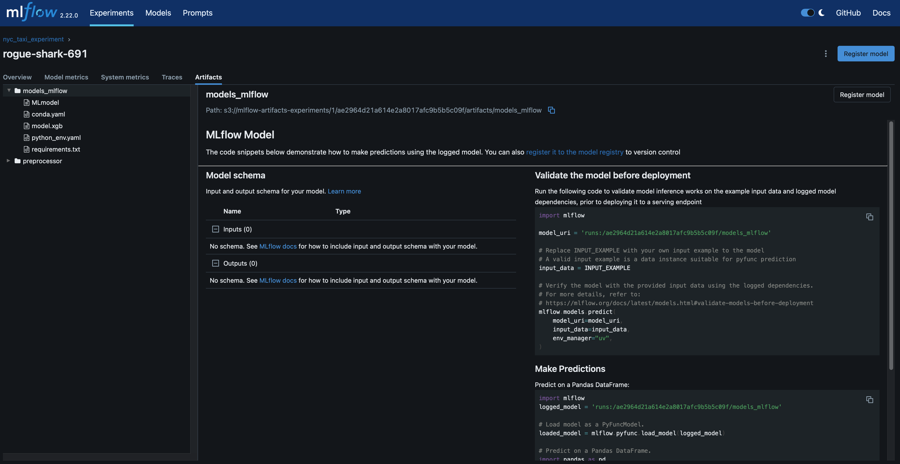

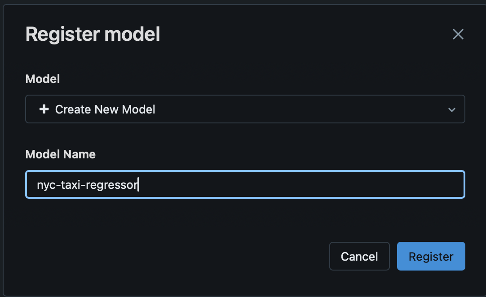

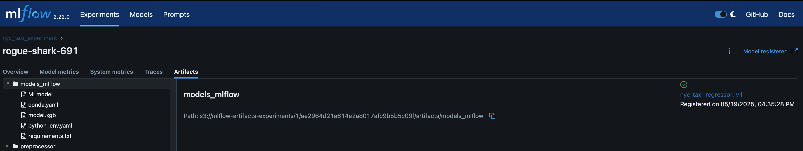

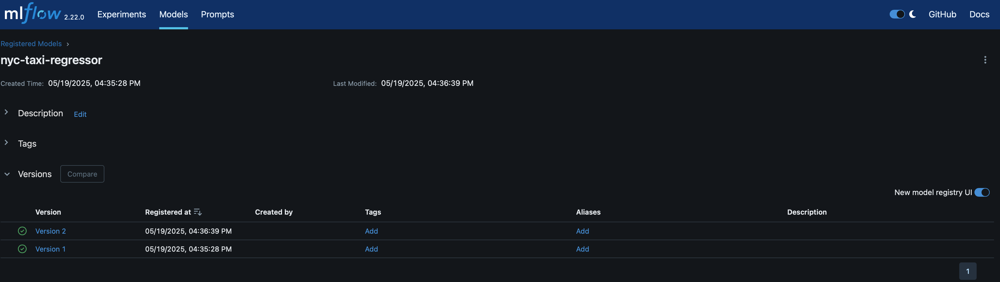